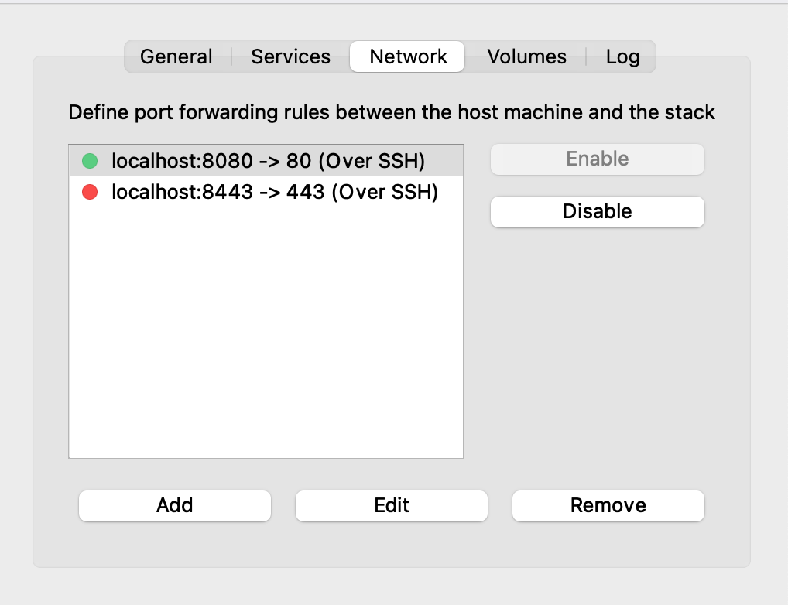
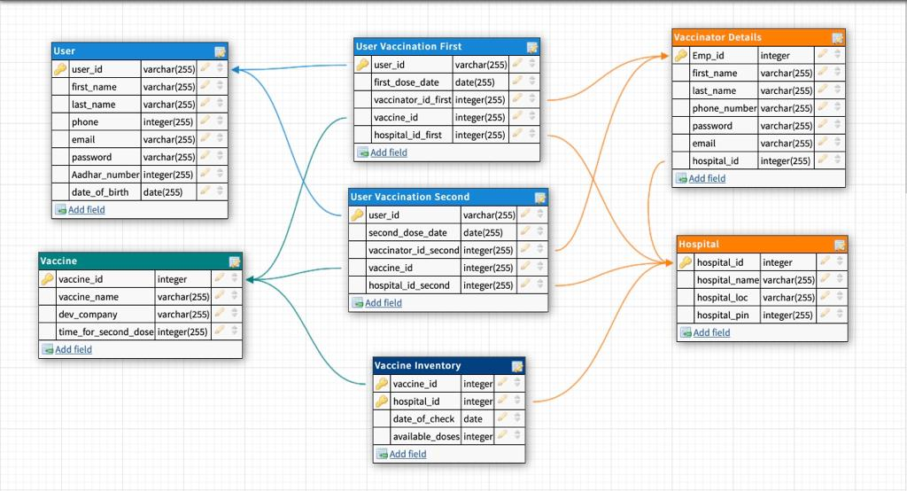
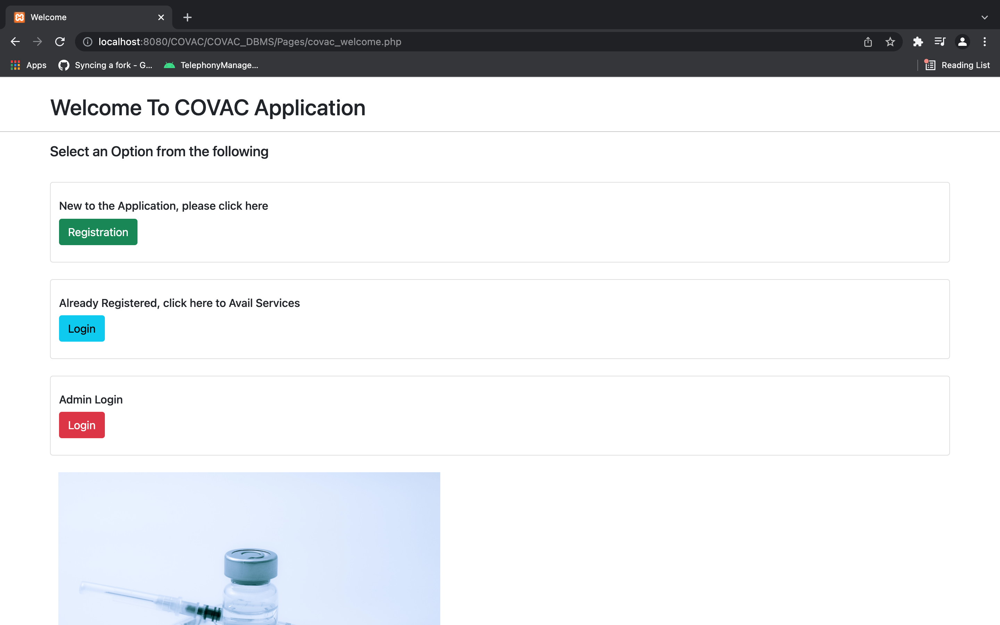

# COVAC_DBMS

<strong>The setup Instrucions are as follows</strong>

Pre requistes to run this application
 - XAMPP
 - XAMPP Control panel with MySQL configured

<br>
 To install XAMPP use this link <a href="https://www.apachefriends.org/download.html">given here</a>!

Navigate to the `htdocs` folder inside your XAMPP directory

Then run the following command to clone the repository

```
git clone https://github.com/Blake2912/COVAC_DBMS.git
```

After clonning the repository, then enable networking in your XAMPP Control Panel

Inside your control panel the networking panel should look something like this:

<center></center>

<center>This is the illustration shown how it looks in MacOS</center>

You will also have to create the database entities and triggers for the application to function properly.

To implement the Database use the schema diagram shown below



You can also copy and paste the given commands after you create the Database and you are in the Maria DB Command Prompt

 - To Create the `USER` table:
```
 CREATE TABLE USER(user_id int PRIMARY KEY,first_name varchar(100),last_name varchar(100),phone int,email varchar(100),password varchar(100),aadhar_number int,dob date);
```
 - To Create the `HOSPITAL` table:
```
CREATE TABLE HOSPITAL(hospital_id  int PRIMARY KEY,hospital_name varchar(100),hospital_loc varchar(100),hospital_pin int);
```
 - To Create the `VACCINE` table:
```
CREATE TABLE VACCINE(vaccine_id int PRIMARY KEY,vaccine_name varchar(100),dev_company varchar(100),time_for_sec_dose int);
```
 - To Create the `VACCINATOR_DETAIL` table:
```
CREATE TABLE VACCINATOR_DETAIL(emp_id int PRIMARY KEY,first_name varchar(100),last_name varchar(100),phone_number int,password varchar(100),email varchar(100), hospital_id int,foreign key(hospital_id) REFERENCES HOSPITAL (hospital_id));
```
 - To Create the `VACCINE_INVENTORY` table:
 ```
CREATE TABLE VACCINE_INVENTORY(vaccine_id int,hospital_id int,check_date date,doses_available int,PRIMARY KEY(vaccine_id,hospital_id),FOREIGN KEY(vaccine_id) REFERENCES VACCINE (vaccine_id),FOREIGN KEY (hospital_id) REFERENCES HOSPITAL (hospital_id));
 ```
 - To Create the `USER_VACCINATION_FIRST` table:
```
CREATE TABLE USER_VACCINATION_FIRST(user_id int PRIMARY KEY,dose_date date,vaccinator_id int,hospital_id int,FOREIGN KEY(user_id) REFERENCES USER(user_id),FOREIGN KEY(vaccinator_id) REFERENCES VACCINATOR_DETAIL(vaccinator_id),FOREIGN KEY(hospital_id) REFERENCES HOSPITAL (hospital_id));
```
 - To Create the `USER_VACCINATION_SECOND` table:
```
CREATE TABLE USER_VACCINATION_SECOND(user_id int PRIMARY KEY,dose_date date,vaccinator_id int,hospital_id int,FOREIGN KEY(user_id) REFERENCES USER(user_id),FOREIGN KEY(vaccinator_id) REFERENCES VACCINATOR_DETAILS(vaccinator_id),FOREIGN KEY(hospital_id) REFERENCES HOSPITAL (hospital_id));
```
 - To Create the `ADMIN` table:
```
CREATE TABLE ADMIN(admin_id int PRIMARY KEY,admin_name varchar(100),admin_password varchar(100));
```

 - To implement `triggers` run the following command in your MySQL database command line/terminal prompt

```
CREATE TRIGGER updateVaccineDoseFirst AFTER UPDATE ON USER_VACCINATION_FIRST FOR EACH ROW UPDATE VACCINE_INVENTORY SET doses_available=doses_available-1, check_date = CURDATE() WHERE VACCINE_INVENTORY.hospital_id IN (SELECT hospital_id FROM USER_VACCINATION_FIRST WHERE VACCINE_INVENTORY.vaccine_id IN (SELECT vaccine_id FROM USER_VACCINATION_FIRST WHERE USER_VACCINATION_FIRST.vaccinator_id IS NOT NULL));
```

```
CREATE TRIGGER updateVaccineDoseSecond AFTER UPDATE ON USER_VACCINATION_SECOND FOR EACH ROW UPDATE VACCINE_INVENTORY SET doses_available=doses_available-1, check_date = CURDATE() WHERE VACCINE_INVENTORY.hospital_id IN (SELECT hospital_id FROM USER_VACCINATION_SECOND WHERE VACCINE_INVENTORY.vaccine_id IN (SELECT vaccine_id FROM USER_VACCINATION_SECOND WHERE USER_VACCINATION_SECOND.vaccinator_id IS NOT NULL));
```

These commands will create the required triggers for your database.

To connect with the database you must also change the username and the password for the `mysqli` connect to the database for the appliction to function properly. 

Do the changes whererver required

After creation of Databases and Triggers your basic setup of the application is <strong>complete</strong>!

Now visit to the below mentioned website link with your favorite web browser

```
http://localhost:8080/COVAC/COVAC_DBMS/Pages/covac_welcome.php
```

If the above link doesn't work then try this link

```
http://localhost/COVAC/COVAC_DBMS/Pages/covac_welcome.php
```

After visiting the link if your browser looks like how it is shown below then congratulations the application is up and running locally in your system.



<br>
<h3>Thank you</h3>

P.S.: If any improvements required please feel free to create a issue and let us know :)
